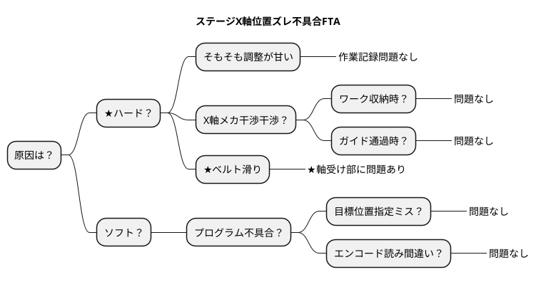

# 第8設備技術勉強会 220305
## 概要
| No | 事例名 | 内容 | 補足 |
| --- | --- | --- | --- |
| 1 | フローチャート | カレーライス工程 | 作業工程見える化 |
| 2 | マインドマップ | ステージ位置ズレ不具合原因 | FTA事例 |
| 3 | ガントチャート | 設備新設＆改造計画 | エクセル予定表置換え |
| 4 | ユースケース図 | 設備操作仕様 | オペレータ/開発者機能 |
| 5 | フローチャート | カレーライス工程 | 作業工程見える化 |

## 1.フローチャート事例

```plantuml
skinparam monochrome true

title カレーライス工程
start

fork
package "カレー"{
    :具材を切る;
    :具材を炒める;
    fork
      repeat:灰汁取り;
      backward:灰汁確認;
      repeat while(灰汁まだでる？)
    fork again
      repeat:具材煮込む;
      backward:具材確認;
      repeat while(具材まだ固い？)
    end fork
}
fork again
package "白米"{
    :米を研ぐ;
    :米を水に浸す;
    :米を炊く;
    :米を蒸らす;
}
end fork

:お皿に白米とカレー入れる;
stop
```

## 2.マインドマップ事例


## ガントチャート事例
```plantuml
language ja
printscale weekly
saturday are closed
sunday are closed
Project starts 2022-02-01

-- 設備1新設 --
[設計1] as [G1] lasts 20 days
[G1] is 100% complete
[G1] starts 2022-02-01

[手配1] as [G2] lasts 40 days
[G2] is 0% complete
[G2] starts 2022-03-01

[組付1] as [G3] lasts 20 days
[G3] is 0% complete
[G3] starts 2022-05-01

[立上1] as [G4] lasts 20 days
[G4] is 0% complete
[G4] starts 2022-06-01

-- 設備2改造 --
[設計2] as [K1] lasts 10 days
[K1] is 100% complete
[K1] starts 2022-02-01

[手配2] as [K2] lasts 10 days
[K2] is 0% complete
[K2] starts 2022-02-14

[組付2] as [K3] lasts 10 days
[K3] is 0% complete
[K3] starts 2022-03-01

[立上2] as [K4] lasts 60 days
[K4] is 0% complete
[K4] starts 2022-03-14

```

## ユースケース事例
```plantuml
skinparam monochrome flase
left to right direction
actor "オペレータ" as be
actor "設備設計者" as pe
rectangle "設備"{
    package "量産運用" {
        usecase "自動運転" as usecase1
    }
    package "開発者評価" {
        usecase "手動操作運転" as usecase2
        usecase "条件指定運転" as usecase3
    }
}
be ---> usecase1
pe ---> usecase1
pe ---> usecase2
pe ---> usecase3
```

## ER図事例
```plantuml
!define MAIN_ENTITY #E2EFDA-C6E0B4
!define MAIN_ENTITY_2 #FCE4D6-F8CBAD
!define METAL #F2F2F2-D9D9D9
!define MASTER_MARK_COLOR AAFFAA
!define TRANSACTION_MARK_COLOR FFAA00
skinparam class {
    BackgroundColor METAL
    BorderColor Black
    ArrowColor Black
}
package "DBテーブル" as target_system {
    entity "PLCマスター" as mplc <<M,TRANSACTION_MARK_COLOR>> MAIN_ENTITY {
        +PLC管理ID[PK]
        --
        工程名
        PLC名
        IPアドレス
        PLC種類
        PLC設置位置
        PLC説明
        更新日時
    }

    entity "PLC状態" as state <<T,TRANSACTION_MARK_COLOR>> MAIN_ENTITY_2 {
        + PLC管理ID [PK/FK]
        --
        接続状態
        異常状態
        動作時間
        更新日時
    }

    entity "PLC異常" as error <<T,TRANSACTION_MARK_COLOR>> MAIN_ENTITY_2 {
        + PLC異常ID   [PK]
        --
        + PLC管理ID [FK]
        PLC異常内容
        更新日時
    }
}
state  ||-ri-|| mplc
mplc ||-ri-|{ error
```
